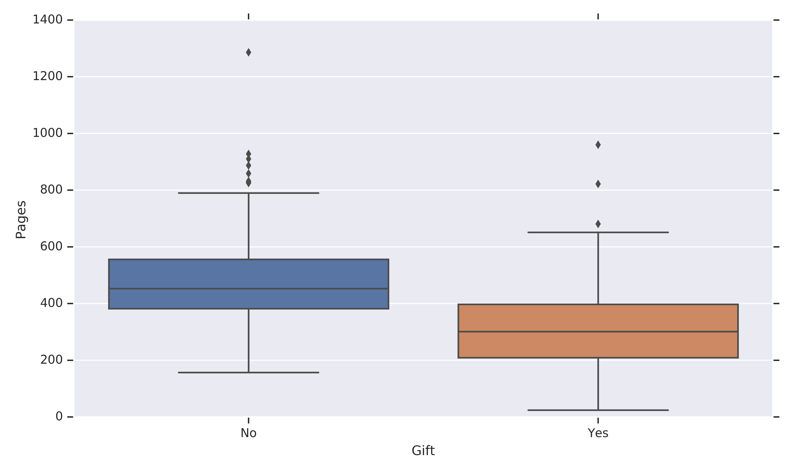
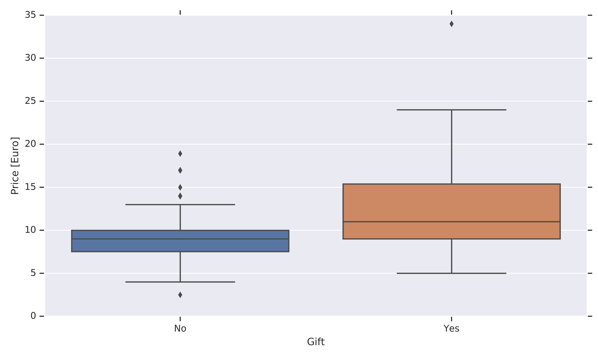

# Machine Learning Book Purchases

Contains a data set of nearly all books I have read so far (title and author removed). I wanted to explore the differences in price/length/language of the books depending on the method of acquisition (purchased myself or obtained as a gift).

This might allow me to automate my decision making process (i.e. do I want to purchase this book myself?).

Current accuracy: 91 % (KNN model).. 

Total books: 388

Book data last updated: 20200813
